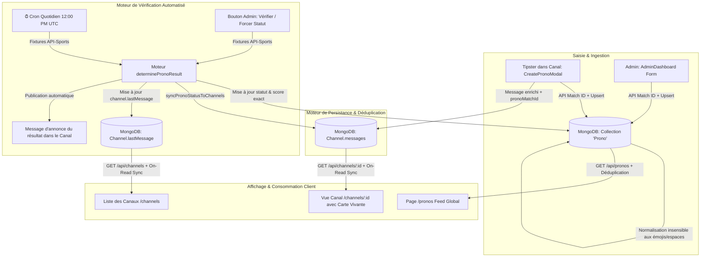
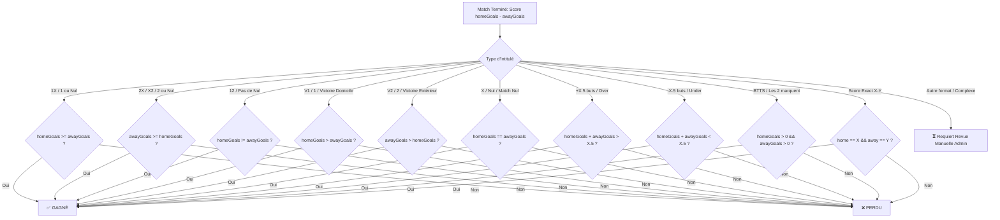

# Architecture & Moteur Unifié des Pronostics — PronosBox

Ce document constitue la référence technique et opérationnelle complète du système unifié de gestion, de publication, de vérification et de synchronisation des pronostics sur PronosBox.

---

## 1. Vision & Principes Fondamentaux

Le système de pronostics de PronosBox est conçu pour unifier trois piliers autrefois hétérogènes :
1. **Le flux des Canaux (Tipsters / Telegram-like)** : Publication rapide de pronostics par les propriétaires de canaux (gratuits et premium).
2. **Le Catalogue Central & Panneau d'Administration** : Gestion centralisée, recherche assistée par date via API Football, création, édition et forçage de statuts.
3. **Le Feed Public (`/pronos`)** : Flux chronologique unifié avec séparation Gratuit / Premium.

### Règle d'or : "Un Match = Un Seul Enregistrement Canonique"
Quel que soit le point d'entrée (publication depuis un canal ou saisie dans le tableau de bord administrateur), le système effectue un **Upsert** intelligent dans MongoDB. Il n'existe jamais de doublons de matchs ou d'identifiants fantômes dans l'écosystème.

---

## 2. Diagramme d'Architecture Globale du Système



---

## 3. Schéma de Données Unifié

### Modèle Mongoose `Prono` (`src/models/Prono.js`)
```typescript
interface IProno {
  matchId: number;                // ID numérique officiel API-Sports (ex: 1605744)
  homeTeamName: string;           // Équipe Domicile
  awayTeamName: string;           // Équipe Extérieur
  homeLogo?: string;
  awayLogo?: string;
  league?: string;                // Nom du championnat ou "Canal X"
  matchDate: Date;                // Date et heure du coup d'envoi
  channelId?: ObjectId;           // Référence au canal d'origine (si applicable)
  messageId?: string;             // ID du message dans le canal

  // Slot Gratuit
  freeExpectedResult: string;     // ex: "1X - Victoire Domicile ou Nul"
  freeConfidence: number;         // 1 à 5 étoiles ou pourcentage (ex: 4 ou 80%)
  freeObservation: string;        // Analyse brève / tactique

  // Slot Premium
  premiumExpectedResult: string;  // ex: "Score exact 2-1"
  premiumOdds: number;            // Cote décimale (ex: 2.10)
  premiumConfidence: number;      // Indice de confiance
  premiumObservation: string;     // Analyse VIP détaillée

  // Statuts & Résolution
  status: 'pending' | 'won' | 'lost' | 'partial'; // Statut global de synthèse
  freeStatus: 'pending' | 'won' | 'lost';
  premiumStatus: 'pending' | 'won' | 'lost';
  actualResult?: string;          // Score final constaté (ex: "2-3")
  verifiedAt?: Date;              // Horodatage de vérification
  reactions: Array<{ emoji: string; users: ObjectId[] }>;
}
```

### Schéma `MessageSchema` dans `Channel` (`src/models/Channel.js`)
Chaque message représentant un pronostic intègre :
- `pronoMatchId` (`Number`) : L'ID officiel du match API-Sports.
- `pronoStatus` (`String`) : `'pending' | 'won' | 'lost' | ''`.
- `pronoActualResult` (`String`) : Le score final (ex: `'3-0'`).

---

## 4. Moteur de Vérification & Règles Métier (`determinePronoResult`)

Le moteur de vérification traduit automatiquement les intitulés de pronostics en règles booléennes face aux scores réels (`homeGoals` vs `awayGoals`).



---

## 5. Synchronisation en Direct & Expérience "Alive" dans les Canaux

Dès qu'un pronostic est vérifié (automatiquement à 12:00 PM UTC ou manuellement par l'administrateur) :

1. **Carte de Message Vivante (`MessageCard.tsx`) :**
   - Le badge d'état passe instantanément de `[⏳ EN ATTENTE]` à **`[✅ GAGNÉ]`** ou **`[❌ PERDU]`**.
   - Un encart **`Score Final : 2 - 3 (Validé)`** s'affiche automatiquement au bas de la carte.
2. **Aperçu du Canal (`channel.lastMessage`) :**
   - Le texte d'aperçu dans la liste des canaux (`/channels`) remplace `(⏳ en attente)` par `(✅ gagné)` ou `(❌ perdu)`.
3. **Annonce Automatique :**
   - Un message récapitulatif officiel est posté dans le fil du canal au nom du propriétaire :
     ```text
     🎯 RÉSULTAT DU PRONOSTIC : Alaves vs Getafe

     ⚽ Match : Alaves vs Getafe
     📊 Score Final : 3-0
     🏆 Résultat : ✅ GAGNÉ 🎉
     ```
4. **Synchronisation à la Lecture ("On-Read Sync") :**
   - Les routes `GET /api/channels` et `GET /api/channels/:id` vérifient rétroactivement tous les messages par rapport aux pronostics validés en base pour garantir une fraîcheur immédiate des données.

---

## 6. Roadmap & Spécifications du Système Premium Futur

### Architecture Prévue pour le CRUD Premium Complet :

1. **Paywall & Gating API :**
   - Dans `GET /api/pronos`, masquer conditionnellement `premiumExpectedResult`, `premiumOdds` et `premiumObservation` pour tout utilisateur non connecté ou non Pro (`user.isPro !== true`).
   - Remplacer les champs masqués par :
     ```json
     {
       "premiumExpectedResult": "🔒 Réservé aux Membres Pro",
       "premiumObservation": "Débloquez l'accès Pro pour consulter l'analyse tactique complète."
     }
     ```
2. **Gestion des Cotes & Calcul Automatisé du ROI :**
   - Suivi des unités misées (Bankroll tracking) et calcul automatique du ROI (%) par canal et par tipster.
3. **Canaux Monétisés avec Abonnement Dédié :**
   - Intégration directe avec CinetPay / NowPayments / Portefeuille pour débloquer l'accès aux canaux `premium: true` avec `subscriptionPrice`.
4. **Exportation de Rapports de Performance :**
   - Génération de graphiques de gains cumulés pour rassurer et convertir les utilisateurs gratuits en abonnés payants.

---

## 7. Guide de Diagnostic & Dépannage Rapide

| Symptôme | Cause Probable | Action Corrective |
|---|---|---|
| Match bloqué en "⏳ Attente" | Match non terminé ou délai de 2h30 non atteint | Utiliser le bouton de vérification individuelle dans l'administration ou forcer le statut via le menu déroulant. |
| Intitulé non reconnu automatiquement | Syntaxe personnalisée non standard | Saisir le statut manuellement dans le tableau de bord (le score est déjà sauvegardé). |
| Message de canal non actualisé | Ancien message sans `pronoMatchId` | La synchronisation On-Read met à jour le message dès l'ouverture du canal par un membre. |
